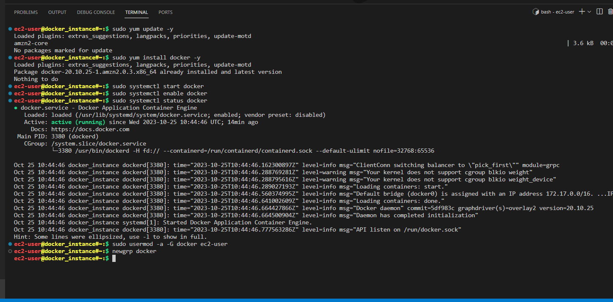
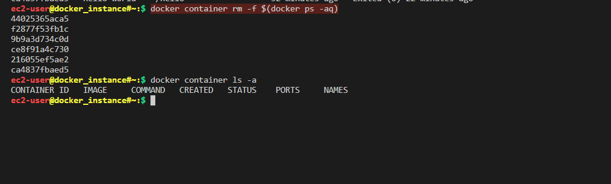

# Hands-on Docker-02 : Docker Container Basic Operations

Purpose of the this hands-on training is to give students the knowledge of basic operation on Docker containers.


## Learning Outcomes

At the end of the this hands-on training, students will be able to;

- list the help about the Docker commands.

- run a Docker container on EC2 instance.

- list the running and stopped Docker containers.

- explain the properties of Docker containers.

- start, stop, and remove Docker containers.

## Outline

- Part 1 - Launch a Docker Machine Instance and Connect with SSH

- Part 2 - Basic Container Commands of Docker

## Part 1 - Launch a Docker Machine Instance and Connect with SSH

- Launch a Docker machine on Amazon Linux 2 AMI with security group allowing SSH connections using the [Cloudformation Template for Docker Machine Installation](../S1A-docker-01-installing-on-ec2-linux2/docker-installation-template.yml).

- Connect to your instance with SSH.

```bash
ssh -i .ssh/call-training.pem ec2-user@ec2-3-133-106-98.us-east-2.compute.amazonaws.com
```

## Part 2 - Install Docker on Amazon Linux 2 EC2 Instance

- Update the installed packages and package cache on your instance.

```bash
sudo yum update -y
```

- Install the most recent Docker Community Edition package.

```bash
sudo yum install docker -y
```

- Start docker service.

- Init System: Init (short for initialization) is the first process started during booting of the computer system. It is a daemon process that continues running until the system is shut down. It also controls services at the background. For starting docker service, init system should be informed.

```bash
sudo systemctl start docker
```

- Enable docker service so that docker service can restart automatically after reboots.

```bash
sudo systemctl enable docker
```

- Check if the docker service is up and running.

```bash
sudo systemctl status docker
```

- Add the `ec2-user` to the `docker` group to run docker commands without using `sudo`.
 sudo kllmd

```bash
sudo usermod -a -G docker ec2-user
```

- Normally, the user needs to re-login into bash shell for the group `docker` to be effective, but `newgrp` command can be used activate `docker` group for `ec2-user`, not to re-login into bash shell.
ec2 docker grb dhl

```bash
newgrp docker
```



- Check the docker version without `sudo`.

```bash
docker version

Client:
 Version:           20.10.17
 API version:       1.41
 Go version:        go1.18.6
 Git commit:        100c701
 Built:             Wed Sep 28 23:10:17 2022
 OS/Arch:           linux/amd64
 Context:           default
 Experimental:      true

Server:
 Engine:
  Version:          20.10.17
  API version:      1.41 (minimum version 1.12)
  Go version:       go1.18.6
  Git commit:       a89b842
  Built:            Wed Sep 28 23:10:55 2022
  OS/Arch:          linux/amd64
  Experimental:     false
 containerd:
  Version:          1.6.6
  GitCommit:        10c12954828e7c7c9b6e0ea9b0c02b01407d3ae1
 runc:
  Version:          1.1.3
  GitCommit:        1e7bb5b773162b57333d57f612fd72e3f8612d94
 docker-init:
  Version:          0.19.0
  GitCommit:        de40ad0
```

- Check the docker info without `sudo`.

```bash
docker info
```

## Part 2 - Basic Container Commands of Docker

- Check if the docker service is up and running.
  
```bash
docker --version
```

- Run either `docker` or `docker help` to see the help docs about docker commands.

```bash
docker help | less
Shift+p+q --> Exit yapar
```

- Run `docker COMMAND --help` to see more information about specific command.

```bash
docker run --help | less
```

```bash
docker run hello-world
```


- Download and run `ubuntu` os with interactive shell open.

```bash
docker run -i -t ubuntu bash
```

- Display the os name on the container for the current user.

```bash
ls
cat /etc/os-release
```


- Display the shell name on the container for the current user.

```bash
echo $0
```

- Update and upgrade os packages on `ubuntu` container.

```bash
apt-get update && apt-get upgrade -y
```


- Show that `ubuntu` container is like any other Ubuntu system but limited.

  - Go to the home folder and create a file named as `myfile.txt`

    ```bash
      cd ~ && touch myfile.txt && ls
      pwd
      exit  # Eğer exit dersek container içindeki bütün oluşturduğumuz çalışmalarımız silinir.
    ```


```bash
docker run -it ubuntu bash
pwd
cd
whoami
ls 
pwd
```

```bash
exit
```


- Docker container properties

- Show the list of all containers available on Docker machine and explain container properties.
process linüx prog çlş hln

```bash
 docker ps --help
 docker ps      # Aktif olan containerleri bize gösteririr.
 docker ps -a   # Tüm containerleri bize gösteririr. Aktif ve Aktif olmayan containerlerin hepsini bize getirir.
```

or

```bash
docker container ls -a  # docker ps -a aynı sonucu verir.Tüm containerleri bize gösteiriyor.En çok bu tercih ediliyor. 
```


- Docker start

```bash
docker start --help
docker start ce8f91a4c730
docker ps
docker start 21
docker ps -a
docker start elastic_wilson
```


- Run the second `ubuntu` os with interactive shell open and name container as `kenan` and show that this `ubuntu` container is different from the previous one.

```bash
docker run -it --name kenan ubuntu bash
exit
docker ps -a
```


- Show the list of all containers again and explain the second `ubuntu` containers' properties and how the names of containers are given.

```bash
docker container ls -a
```


- Restart the first container by its `ID`.

```bash
docker start 9b
```

- Show only running containers and explain the status.

```bash
docker container ls  # docker ps ile aynı sonucu verir.
```


- Stop the first container by its `ID` and show it is stopped.

```bash
docker stop 9b && docker container ls -a
docker stop ce8 ca48 44 && docker container ls # Burda Birden fazla containerleri unique değerlerini referans alarak stop yaparak son durumunu listeledik. 
```


- Restart the `kenan` container by its name and list only running containers.

```bash
docker start kenan && docker container ls
```


- Connect to the interactive shell of running `kenan` container and `exit` afterwards.
İmage list

```bash
docker images
docker image ls
```


```bash
docker run nginx
ctrl c                # Terminali meşgul ettiği için CTRL + C diyerek termianalden çıkıyoruz.
docker ps -a
docker  rm ca73691

docker run -d nginx   # -d ile Terminali bize ver arka planda sen çalıştır.termianli meşgul etme yani onu söylüyoruz.
docker ps
docker rm -f 38
docker run -d -p 80:80 nginx  # -d terminali bize ver;  -p port  80:80 (localPort:containerPort) 
docker exec 1db32 ls pwd date  # containerin içine girmeden komut çalıştırmak için ise 'exec' komutunu kullanıyoruz.
docker exec -it 1db32 bash
exit
```


- **exec** komutu ile  containerlere bağlanıp makinenin içine girebiliyoruz.

- Show that  container has stopped by listing all containers.

```bash
docker run -d -p 81:80 httpd
docker container ls -a
```


- Restart the first container by its `ID` again and exec -it to it to show that the file we have created is still there under the home folder, and exit afterwards.

```bash
docker start 4e6 && docker exec -it 4e6 bash
exit
```


- Show that we can get more information about `kenan` container by using `docker inspect` command and explain the properties.

```bash
docker inspect kenan | less   # inspect ile containerin varolan bütün özellikleri bize getirir.
```

- Delete the first container using its `ID`.

```bash
docker rm 4e6
```

- Delete the second container using its name.

```bash
docker rm 124                   # Aktif olan bir containeri(ID=124...) stop etmeden silemeyiz. Önce bu containeri(ID=124...) stop edip(docker stop 124) sonrasında silmemiz gerekiyor.(docker rm 124)
docker container rm -f 6354              # Aktif olan bir containeri stop etmeden de zorla silebiliriz -f (force) komutunu kullanarak (docker container rm -f 124)
docker container prune                   # Bu komut aktif olmayan containerleri siler. 
docker container rm -f $(docker ps -aq)  # Bu komut tüm containerleri çalışıyor olsa bile tek işlemde siler.
docker container ls -a
```



```text
- docker container prune: Bu komut, kullanılmayan veya gereksiz Docker konteynerlerini temizlemek için kullanılır. Bu komut, çalışmayan konteynerleri, durdurulmuş konteynerleri ve gereksiz olanları kalıcı bir şekilde siler. Silinen kayıtlar geri döndürülemez bunu için yine de silinenlere iyice bakmak da fayda var. Bu komut, Docker ortamınızı temiz ve düzenli tutmanıza yardımcı olur ve gereksiz kaynakları serbest bırakır.

- docker container rm -f $(docker ps -aq): Bu komut, tüm Docker konteynerlerini zorla (force) durdurarak ve ardından silerek kaldırmak için kullanılır. İşte bu komutun ayrıntıları:
  -- docker ps -aq : Bu bölüm, çalışan veya durmuş tüm Docker konteynerlerinin ID'lerini listeleyen bir altkomuttur. -q bayrağı, sadece konteynerlerin ID'lerini (kısaltmalarını) alır ve bu, daha temiz bir çıktı üretir.
  -- docker container rm -f : Bu bölüm, Docker konteynerlerini kaldırmak için kullanılır. -f bayrağı, bir konteyneri zorla (force) durdurarak kaldırır. Bu, çalışan konteynerleri bile durdurmadan kaldırılmasını sağlar. Konteynerler zorla durdurulup ardından silinir.
- Sonuç olarak, **docker container rm -f $(docker ps -aq)** komutu, tüm Docker konteynerlerini silmek için kullanılır. 

```
