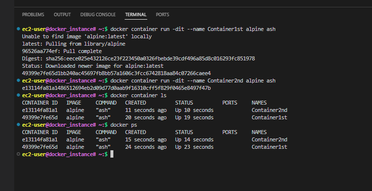
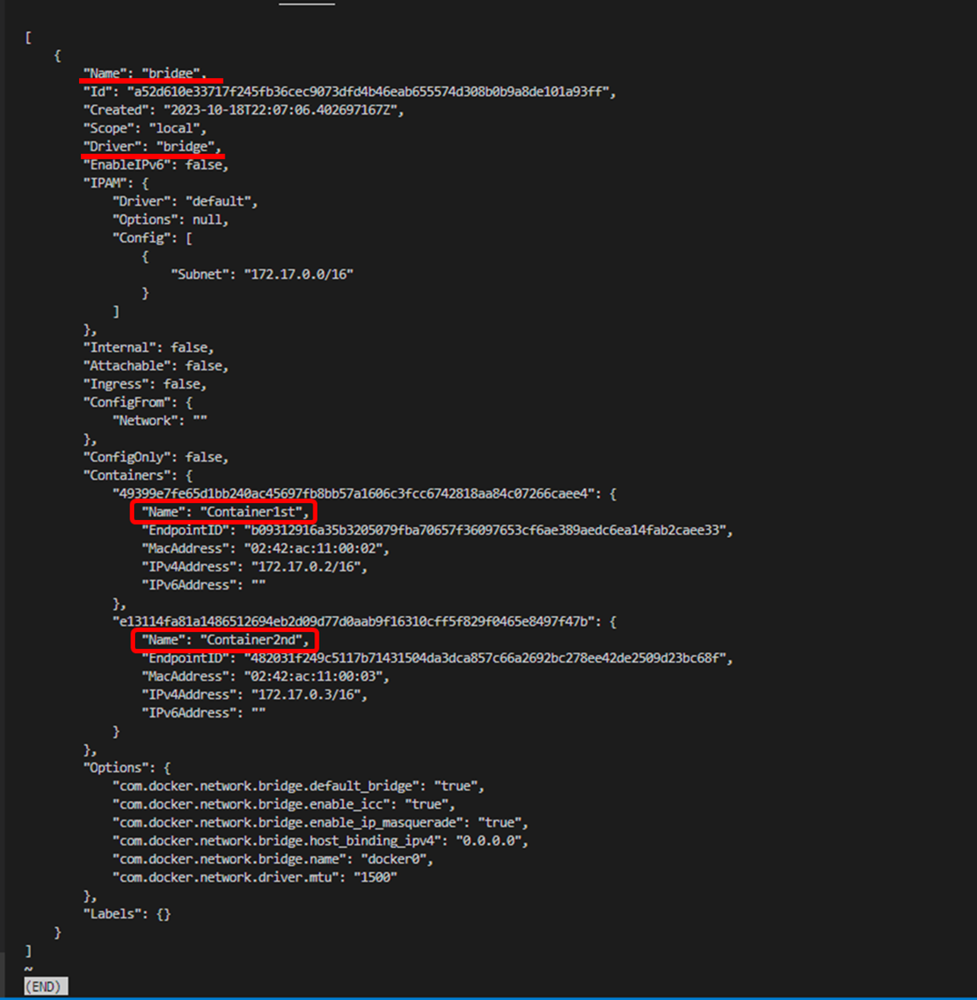
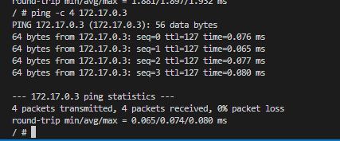

# Hands-on Docker-04 : Docker Networking

Purpose of the this hands-on training is to give the student understanding to networking in Docker.

## Learning Outcomes

At the end of the this hands-on training, students will be able to;

- list available networks in Docker.

- create a network in Docker.

- inspect properties of a network in Docker.

- connect a container to a network.

- explain default network bridge configuration.

- configure user-defined network bridge.

- ping containers within same network.

- can bind containers to specific ports.

- delete Docker networks.

## Outline

- Part 1 - Launch a Docker Machine Instance and Connect with SSH

- Part 2 - Default Network Bridge in Docker

- Part 3 - User-defined Network Bridge in Docker

- Part 4 - Container Networking

## Part 1 - Launch a Docker Machine Instance and Connect with SSH

- Launch a Docker machine on Amazon Linux 2 AMI with security group allowing SSH connections using the [Cloudformation Template for Docker Machine Installation](../docker-01-installing-on-ec2-linux2/docker-installation-template.yml).

- Building Terraform codes for Docker Instances : terraform init --> terraform plan --> terraform apply --auto-approve and Dont forget Finally terraform destroy
  


- Connect to your instance with SSH.
  


- Go to .bashrc file and paste any one for colorful terminal

```bash
PS1="\[\e[1;33m\]\u\[\e[35m\]@\h# \W:\[\e[32m\]\\$\[\e[m\] " 
# PS1="\\[\e[1;31m\]\\u\[\\e[33m\]@\h#\W:\[\e[32m\]\\\$ \[\e[m\]"  # or
```


```bash
ssh -i .ssh/call-training.pem ec2-user@ec2-3-133-106-98.us-east-2.compute.amazonaws.com
```

## Part 2 - Default Network Bridge in Docker

- Check if the docker service is up and running.

```bash
systemctl status docker   # Docker'ın durumunu öğrenmek için kullanırız.
```


- List all networks available in Docker, and explain types of networks.

```bash
docker network ls
```


- Run two `alpine` containers with interactive shell(-it), in detached mode(-d), name the container as `Container1st` and `Container2nd`, and add command to run alpine shell. Here, explain what the detached mode means.

```bash
docker container run -dit --name Container1st alpine ash
docker container run -dit --name Container2nd alpine ash
```

- Show the list of running containers on Docker machine.

```bash
docker ps
```



- Show the details of `bridge` network, and explain properties (subnet, ips) and why containers are in the default network bridge.

```bash
docker network inspect bridge | less
q or wq (for Quıit)
```



- Get the IP of `Container2nd` container.

```bash
docker container inspect Container2nd | grep IPAddress  # Container2nd containerine ait IPAdresi bize getir.
```


- Connect to the `Container1st` container.

```bash
docker container exec -it Container1st ash
```

- Show the details of network interface configuration of `Container1st` container.

```bash
ifconfig
```


- Open an other terminal and connect your ec2 instance. Show the details of network interface configuration of ec2 instance.

```bash
ifconfig
```


- Compare with two configurations.

- In the `Container1st` container ping google.com four times to check internet connection.

```bash
ping -c 4 google.com   # google.com'a 4 -c (count) tane ping atıyoruz
```


- Ping `Container2nd` container by its IP four times to show the connection.

```bash
ping -c 4 172.17.0.3
```



- Try to ping `Container2nd` container by its name, should face with bad address. Explain why failed (due to default bridge configuration not works with container names)

```bash
ping -c 4 Container2nd
```


- Disconnect from `Container1st` without stopping it (CTRL + p + q).

- Stop and delete the containers

```bash
docker container stop Container1st Container2nd
docker container rm Container1st Container2nd
```


## Part 3 - User-defined Network Bridge in Docker

- Create a bridge network `kenanklc_network`.

```bash
docker network create --driver bridge kenanklc_network
```

- List all networks available in Docker, and show the user-defined `kenanklc_network`.

```bash
docker network ls
```


```text
**Note:** Docker installation ile birlikte gelen ve default olarak oluşturulan tüm containerların aksi belirtilmedikçe dahil olduğu networktur. Aslnda bu network'e dahil olan tüm containerlar kendi aralarında iletişim halindedirler. Birbiriyle IP üzerinden ping atabilirler fakat name üzerinden ping atamazlar.
```

- Show the details of `kenanklc_network`, and show that there is no container yet.

```bash
docker network inspect kenanklc_network
```


- Run four `alpine` containers with interactive shell, in detached mode, name the containers as `Container1st`, `Container2nd`, `Container3rd` and `Container4th`, and add command to run alpine shell. Here, 1st and 2nd containers should be in `kenanklc_network`, 3rd container should be in default network bridge, 4th container should be in both `kenanklc_network` and default network bridge.

```bash
docker container run -dit --network kenanklc_network --name Container1st alpine ash
docker container run -dit --network kenanklc_network --name Container2nd alpine ash
docker container run -dit --name Container3rd alpine ash
docker container run -dit --name Container4th alpine ash
docker network connect kenanklc_network Container4th
```

- List all running containers and show there up and running.

```bash
docker container ls
```


- Show the details of `kenanklc_network`, and explain newly added containers. (1st, 2nd, and 4th containers should be in the list)

```bash
docker network inspect kenanklc_network
```


- Show the details of  default network bridge, and explain newly added containers. (3rd and 4th containers should be in the list)

```bash
docker network inspect bridge
```


- Connect to the `Container1st` container.

```bash
docker exec -it Container1st ash
```

- Ping `Container2nd` and `Container4th` container by its name to show that in user-defined network, container names can be used in networking.

```bash
ping -c 4 Container2nd
ping -c 4 Container4th
```


- Try to ping `Container3rd` container by its name and IP, should face with bad address because 3rd container is in different network.

```bash
ping -c 4 Container3rd
ping -c 4 172.17.0.2
```


- Ping google.com to check internet connection.

```bash
ping -c 4 google.com
```


- Exit the `Container1st` container without stopping and return to ec2-user bash shell.

- Connect to the `Container4th` container, since it is in both network should connect all containers.

```bash
docker  exec -it Container4th ash
```

- Ping `Container2nd` and `Container1st` container by its name, ping `Container3rd` container with its IP. Explain why used IP, instead of name.

```bash
ping -c 4 Container1st
ping -c 4 Container2nd
ping -c 4 172.17.0.2
```


- Exit from `Container4th` container. Stop and remove all containers.

```bash
docker container stop Container1st Container2nd Container3rd Container4th  # Aktif durumda olan containerleri direk "rm" komutu ile silemiyoruz öncelikle stop durumuna getirmemiz gerekiyor.
docker container rm Container1st Container2nd Container3rd Container4th
```

```bash
docker container rm -f Container1st Container2nd Container3rd Container4th  # remove force four containers
```


- Delete `kenanklc_network` network

```bash
docker network rm kenanklc_network
```


## Part 4 - Container Networking

- Run a `nginx` web server, name the container as `ng`, and bind the web server to host port 8080 command to run alpine shell. Explain `--rm` and `-p` flags and port binding.

```bash
docker container run --rm -d -p 8080:80 --name ng nginx
```


- Add a security rule for protocol HTTP port 8080 and show Nginx Web Server is running on Docker Machine.

```text
http://ec2-34-201-146-106.compute-1.amazonaws.com:8080
```


- Stop container `ng`, should be removed automatically due to `--rm` flag.

```bash
docker container stop ng
```


- Run a `nginx` web server, name the container as `my_nginx`, and connect the web server to none network.

## Network Host

```bash
docker container run --rm -dit --network host --name my_nginx nginx  #  "--rm Bu komut container ile olan işin tamamladıktan sonra stop olunca otomatik olarak kaldır anlamına geliyor.
```


- Yani kaynak makine networku üzerinden oluştur. **host** bu anlama geliyor.

- Show Nginx Web Server is running on **Docker Machine**.

```text
http://ec2-34-201-146-106.compute-1.amazonaws.com/
```


- Show the details of network interface configuration of `my_nginx` container.

```bash
docker container exec -it my_nginx sh
ifconfig
apt-get update
apt-get install net-tools
ifconfig
```


- Open an other terminal and connect your ec2 instance. Show the details of network interface configuration of ec2 instance.

```bash
ifconfig
```

- Show that two configurations are the same.


- Exit and stop container `my_nginx`, should be removed automatically due to `--rm` flag.

```bash
docker container stop my_nginx
```


- Run an `alpine` container, name the container as `nullcontainer`, and connect the web server to none network.

## None Network

```bash
docker container run --rm -it --network none --name nullcontainer alpine
```

- Show the details of network interface configuration of `nullcontainer` container.

```bash
ifconfig
```

- Notice that it has only loopback(localhost) interface.

- Try to ping `google.com`, should face with bad address. Explain why failed (due to none network configuration)

```bash
ping -c 4 google.com
```


- Exit from container `nullcontainer`, should be removed automatically due to `--rm` flag.

```bash
docker container rm -f $(docker ps -aq)
```
