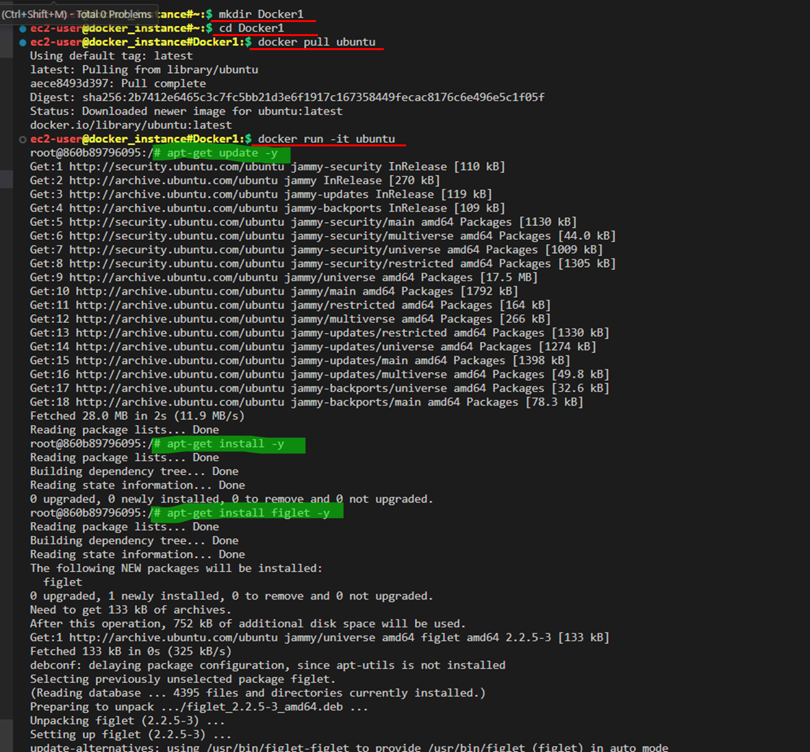
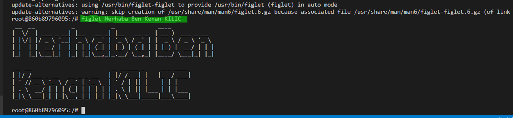
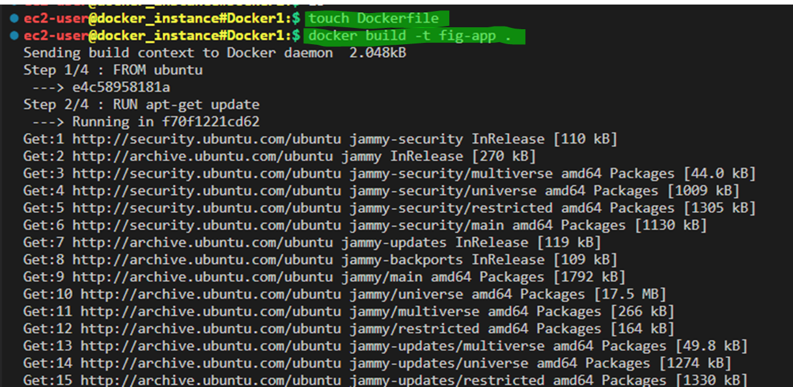
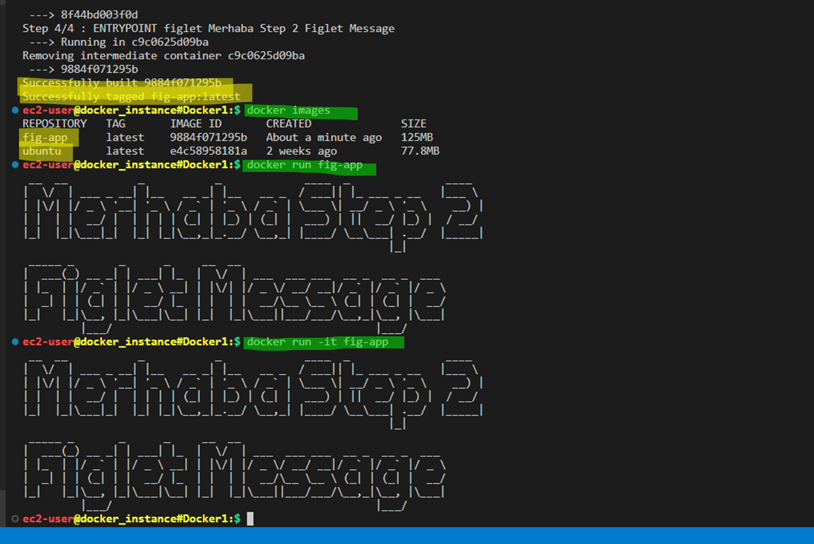
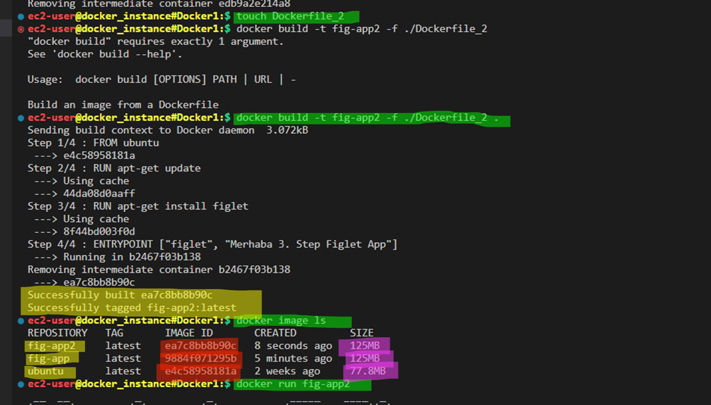
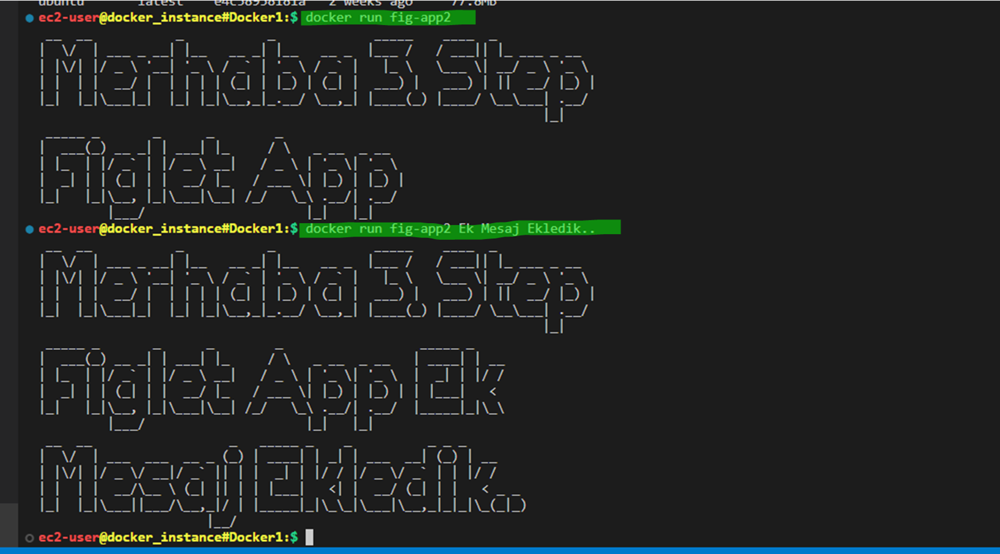
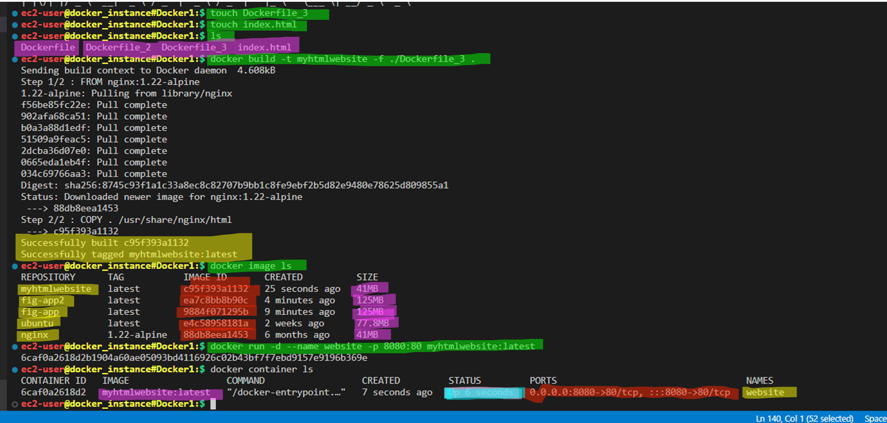
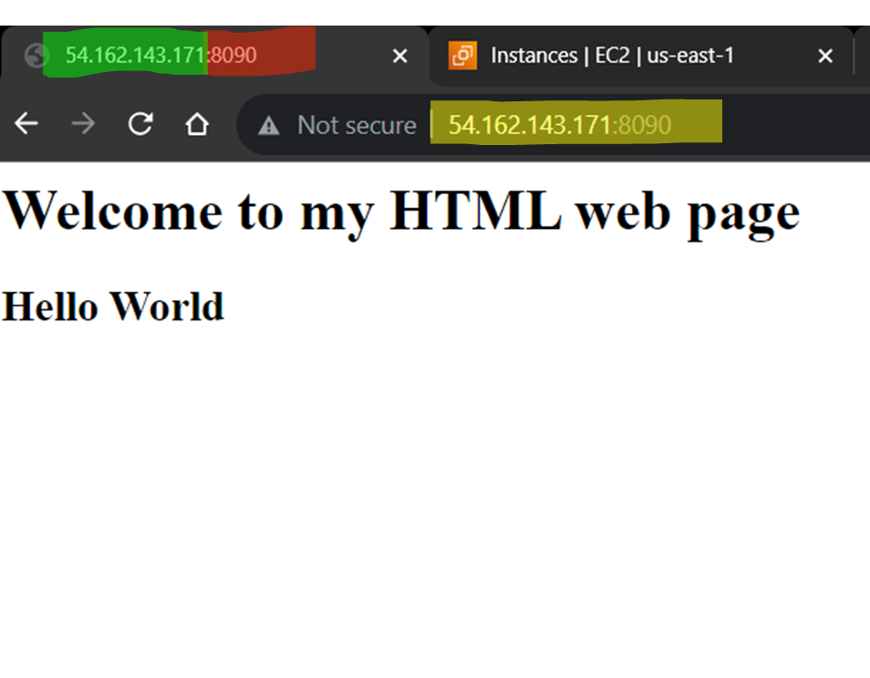

# Build a simple Docker Image using Dockerfile

## Manual Steps

open Docker1 folder
cd Docker1
open figlet file

- pull an ubuntu image

```bash
docker pull ubuntu
```

- run the container interactively

```bash
docker run -it ubuntu
```

- update packages in the container

```bash
apt-get update -y
```

- install figlet app

```bash
apt-get install figlet
```

- run the app

```bash
figlet Merhaba B149 aws-devops! 
```





## Do with Dockerfile

- Create the Dockerfile with nano or your favorite editor

```Dockerfile
FROM ubuntu
RUN apt-get update
RUN apt-get install figlet
ENTRYPOINT figlet Merhaba B149 aws-devops
# CMD can also be used here
```

- Build the image

```bash
docker build -t fig-app .
```

- View the images

```bash
docker images
```

- Run the image as a container

```bash
docker run fig-app
```





```text
 __  __           _           _             ____  _  ___ _____ 
|  \/  | ___ _ __| |__   __ _| |__   __ _  | __ )/ |/ _ \___  |
| |\/| |/ _ \ '__| '_ \ / _` | '_ \ / _` | |  _ \| | | | | / / 
| |  | |  __/ |  | | | | (_| | |_) | (_| | | |_) | | |_| |/ /  
|_|  |_|\___|_|  |_| |_|\__,_|_.__/ \__,_| |____/|_|\___//_/   

```

## Pass arguments to container at runtime using ENTRYPOINT exec mode

- Modify the Dockerfile

```Dockerfile
FROM ubuntu
RUN apt-get update
RUN apt-get install figlet
ENTRYPOINT ["figlet", "Merhaba"]
```

- Build the image

```bash
docker build -t fig-app2 .
```

- View the images

```bash
docker images
```

- Run the image as a container, this time passing an argument

```bash
docker run fig-app2 Dockerseverler!
```





```text
__  __           _           _           
|  \/  | ___ _ __| |__   __ _| |__   __ _ 
| |\/| |/ _ \ '__| '_ \ / _` | '_ \ / _` |
| |  | |  __/ |  | | | | (_| | |_) | (_| |
|_|  |_|\___|_|  |_| |_|\__,_|_.__/ \__,_|
                                     
 ____             _                                     _           
|  _ \  ___   ___| | _____ _ __ ___  _____   _____ _ __| | ___ _ __ 
| | | |/ _ \ / __| |/ / _ \ '__/ __|/ _ \ \ / / _ \ '__| |/ _ \ '__|
| |_| | (_) | (__|   <  __/ |  \__ \  __/\ V /  __/ |  | |  __/ |   
|____/ \___/ \___|_|\_\___|_|  |___/\___| \_/ \___|_|  |_|\___|_|   

```

## Dockerize HTML page and a Node App

Docker Hub is a registry, collection of repos
On Docker Hub you can have public or private repositories for your applications
Repository is having versions of an application, collection of related images

### Convert your index.html simple web page to a Docker Image

open folder
mkdir devops
cd devops

- Create index.html file

```html
<h1>Welcome to My HTML web page</h1>

<h2>Hello World</h2>
```

- Create a Dockerfile

```Dockerfile
FROM nginx:1.22-alpine
COPY . /usr/share/nginx/html
```

- Build the image

```bash
docker build -t mysite .
```

- Run the image as container

```bash
docker run -d -p 8090:80 mysite:latest
```




