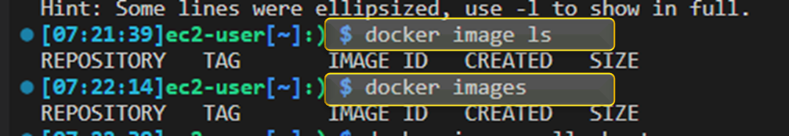
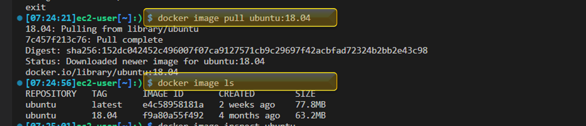
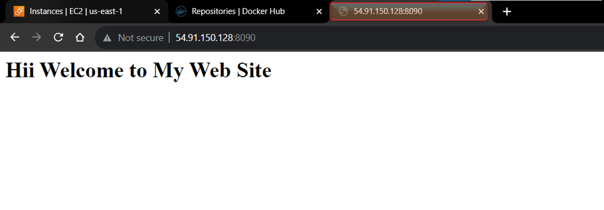
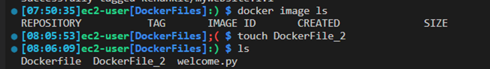

# Hands-on Docker-05 : Docker Image Basic Operations


## Part 1 - Launch a Docker Machine Instance, Connect with SSH and  Install Docker on Amazon Linux 2 EC2 Instance

- Launch a Docker machine on Amazon Linux 2 AMI with security group allowing SSH connections .(SSH 22 Anywhere, HTTP 80 Anywhere & Custom TCP Kalsin 8080 Anywhere)

- Connect to your instance with SSH.

```bash
ssh -i "key.pem" ec2-user@ec2-1-234-567-89.us-east-2.compute.amazonaws.com
```

- Update the installed packages and package cache on your instance.

```bash
sudo yum update -y
```

- Install the most recent Docker Community Edition package.

```bash
sudo amazon-linux-extras install docker -y
```

- Start docker service.

```bash
sudo systemctl start docker
```

- Enable docker service so that docker service can restart automatically after reboots.

```bash
sudo systemctl enable docker
```

- Check if the docker service is up and running.

```bash
sudo systemctl status docker
```

- Add the `ec2-user` to the `docker` group to run docker commands without using `sudo`.

```bash
sudo usermod -a -G docker ec2-user
```

- Normally, the user needs to re-login into bash shell for the group `docker` to be effective, but `newgrp` command can be used activate `docker` group for `ec2-user`, not to re-login into bash shell.

```bash
newgrp docker
```


- Biz bu yukradaki tüm adımları tek bir adımda terraform kdo init and apply ederek ortamı hazırlamış oluyoruz. 

## Part 2 - Using Docker Image Commands and Docker Hub

- Sign up to Docker Hub and explain the UI.

- Create a repository with the name of `flask-app` and description of `This image repo holds Flask apps.`.

- Check if the docker service is up and running on EC2 instance.

```bash
systemctl status docker
```


- List images in Docker and explain properties of images.

```bash
docker image ls
docker images
```



- Download Docker image `ubuntu` and explain image tags (defaults to `latest`) on Docker Hub. Show `ubuntu` repo on Docker Hub and which version the `latest` tag corresponds to (`20.04`).

```bash
# Default to ubuntu:latest
docker image pull ubuntu
docker image ls
```


- Run `ubuntu` as container with interactive shell open.

```bash
docker run -it ubuntu
```


- Display the `ubuntu` os info on the container (`VERSION="20.04 LTS (Focal Fossa)"`) and note that the `latest` tag is showing release `20.04` as in the Docker Hub. Then exit the container.

```bash
cat /etc/os-release
exit
```

- Download earlier version (`18.04`) of `ubuntu` image, which is tagged as `18.04` on Docker Hub and explain image list.

```bash
docker image pull ubuntu:18.04
docker image ls
```



- Inspect `ubuntu` image and explain properties.

```bash
# Default to ubuntu:latest
docker image inspect ubuntu
# Ubuntu with tag 18.04
docker image inspect ubuntu:18.04
```


- Search for Docker Images both on `bash` and on Docker Hub.
  
```bash
docker search ubuntu
```


## Part 3 - Building Docker Images with Dockerfile

- Build an image of Python Flask app with Dockerfile based on `python:alpine` image and push it to the Docker Hub.

- Create a folder to hold all files necessary for creating Docker image.

```bash
mkdir DockerFiles
cd DockerFiles
```


- Create application code and save it to file, and name it `welcome.py`

```bash
from flask import Flask
app = Flask(__name__)
@app.route("/")
def hello():
    return "<h1>Hii Welcome to My Web Site</h1>"
if __name__ == "__main__":
    app.run(host="0.0.0.0", port=80)
```

- Create a Dockerfile listing necessary packages and modules, and name it `Dockerfile`.

```bash
nano Dockerfile
```

```Dockerfile
FROM ubuntu
RUN apt-get update -y
RUN apt-get install python3 -y
RUN apt-get install python3-pip -y
RUN pip3 install flask
COPY . /app
WORKDIR /app
CMD python3 ./welcome.py
```


```text

# Bu bir Dockerfile adlı dosyanın içeriğini temsil eder. Dockerfile, bir Docker konteyneri oluşturmak için kullanılan bir dosyadır. İşte bu Dockerfile'daki her komutun ne yaptığının açıklamaları:

# FROM ubuntu: Bu komut, Docker konteynerinizin temel imajını belirler. Bu Docker konteyneri, Ubuntu işletim sistemi üzerine kurulu olacak.

# RUN apt-get update -y: Bu komut, Ubuntu paket yöneticisi olan APT'yi kullanarak sistemdeki paketlerin güncellenmesini sağlar. -y bayrağı, güncelleme işleminin otomatik onay almasını sağlar.

# RUN apt-get install python3 -y: Bu komut, Python 3'ü Ubuntu üzerinde yükler. Yine -y bayrağı, yükleme işlemi sırasında herhangi bir onay gerektirmeyeceğini belirtir.

# RUN apt-get install python3-pip -y: Bu komut, Python 3 için paket yöneticisi olan pip'i yükler. Yine -y bayrağı, onay gerektirmeyen bir kurulumu temsil eder.

# RUN pip3 install flask: Bu komut, Python 3 için Flask adlı bir web uygulaması çerçevesini yükler. Flask, web uygulamaları geliştirmek için kullanılır.

# COPY . /app: Bu komut, Dockerfile'ın bulunduğu dizindeki tüm dosyaları (.) Docker konteynerinin içindeki /app dizinine kopyalar. Bu, Docker konteynerine uygulama kodunun eklenmesini sağlar.

# WORKDIR /app: Bu komut, çalışma dizinini (WORKDIR) Docker konteynerinin içinde /app dizini olarak ayarlar. Bu, sonraki komutların bu dizin içinde çalışmasını sağlar.

# CMD python3 ./welcome.py: Bu komut, Docker konteyneri başladığında otomatik olarak çalışacak komutu belirler. Bu komut, /app dizinindeki welcome.py adlı Python betiğini çalıştırır.

# Sonuç olarak, bu Dockerfile, Ubuntu tabanlı bir Docker konteyneri oluşturur, içine Python 3, pip ve Flask kurar, ardından bir Flask uygulamasını içeren bir dizini konteynerin içine kopyalar ve bu uygulamayı çalıştırır. 
# Bu, bir Flask web uygulamasını Docker konteynerinde çalıştırmak için kullanılabilir.

```

```bash
docker build -t <dockerhubusername>/flask-app:1.0 . # DockerHub username is kenanklc ve Ayrıca sondaki "." işareti ise mevcut dizin içerisindeki Dockerfile dosyasını referans alarak image build et yani oluştur diyoruz  
docker image ls
```


```bash
docker run -d --name welcome -p 8090:80 <dockerhubusername>/flask-app:1.0
```



- Login in to Docker with credentials.

```bash
docker login   # Enter your Docker account of username and password
```

- Push newly built image to Docker Hub, and show the updated repo on Docker Hub.

```bash
docker push <dockerhubusername>/flask-app:1.0
```


`Dockerfile_2`

- This time, we reduce the size of image.

- Create a Dockerfile listing necessary packages and modules, and name it `Dockerfile_2`


  
```Dockerfile
FROM python:alpine
RUN pip install flask
COPY . /app
WORKDIR /app
EXPOSE 80
CMD python ./welcome.py
```

- Build Docker image from Dockerfile locally, tag it as `<Your_Docker_Hub_Account_Name>/<Your_Image_Name>:<Tag>` and explain steps of building. Note that repo name is the combination of `<Your_Docker_Hub_Account_Name>/<Your_Image_Name>`.

```bash
docker build -t "<dockerhubusername>/flask-app:2.0" -f ./Dockerfile_2 .  # -f: file 
docker image ls
```


- Note that while the size of `<dockerhubusername>/flask-app:1.0` is approximately 400MB, the size of `techpro/flask-app:2.0` is 59.7MB.

- Run the newly built image as container in detached mode, connect host `port 8090` to container `port 80`, and name container as `welcome`. Then list running containers and connect to EC2 instance from the browser to show the Flask app is running.

```bash
docker run -d --name welcome2 -p 8080:80 <dockerhubusername>/flask-app:2.0  # -p : publish yayın yap
```

- Stop and remove the container `welcome`.

```bash
docker stop welcome && docker rm welcome
```

- Push newly built image to Docker Hub, and show the updated repo on Docker Hub.

```bash
docker push <dockerhubusername>/flask-app:2.0
```


- We can also tag the same image with different tags.

```bash
docker image tag <dockerhubusername>/flask-app:2.0 techpro/flask-app:latest
```


- Delete image with `image id` locally.

```bash
docker image rm 497
```
